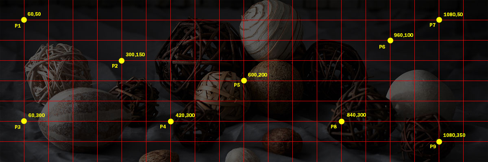

# FocalPoint
A simple [jQuery](http://jquery.com/) plugin that keeps a point of an image within the container when it is resized.

### Usage


```
<!-- markup -->
<div id="fPoint_1" class="container">
    
</div>
```
```
/* css */
.container
{
    max-width: 1200px;
    height: 400px;
    position: relative;
    overflow: hidden;
}
```
```
// js
$("selector").FocalPoint(options);
```

### Options
`x ` {int} _default undefined:_ default will assume horizontal center of the image. Pass a value starting at 0 from the left edge of the image (eg: 840).

`y` {int} _default undefined:_ default will assume vertical center of the image. Pass a value starting at 0 from teh top edge of the image (eg: 300).

`animate` {bool} _default true:_ whether to animate the repositioning of the image.

`animateOnExpand` {bool} _default false:_ prevents animation when the container is expanded. Setting this to true will allow the image to animate when the container is expanded but there is a risk that there could be empty space between the edge of the image and container until the animation kicks in.

`animateOptions` {object} _default {}:_ feel free to use any of normal jQuery `.animate()` [options.](http://api.jquery.com/animate/#animate-properties-options)